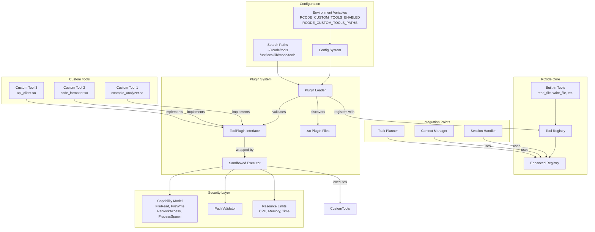
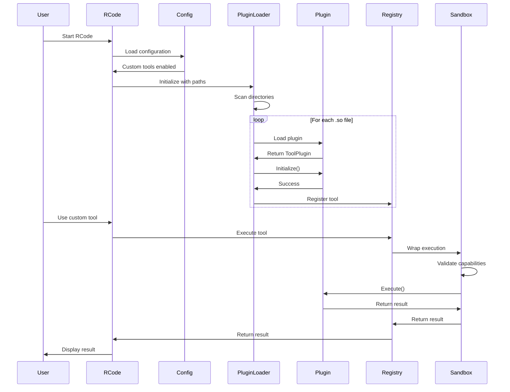
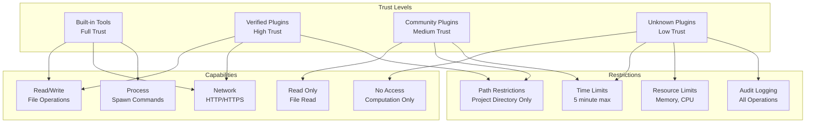

# Custom Tool Architecture Diagram

## System Architecture



## Plugin Lifecycle



## Data Flow

```mermaid
graph LR
    subgraph "Input"
        UserRequest[User Request<br/>"use my_custom_tool"]
        ToolParams[Tool Parameters<br/>{message: "test"}]
    end
    
    subgraph "Validation"
        SchemaValidation[Schema Validation]
        CapabilityCheck[Capability Check]
        PathValidation[Path Validation]
    end
    
    subgraph "Execution"
        ContextSetup[Context Setup<br/>Timeout, Cancel]
        PluginExecute[Plugin.Execute()]
        ResultCapture[Result Capture]
    end
    
    subgraph "Output"
        SuccessResult[Success Result]
        ErrorResult[Error Result]
        Metrics[Metrics Update]
    end
    
    UserRequest --> SchemaValidation
    ToolParams --> SchemaValidation
    SchemaValidation --> CapabilityCheck
    CapabilityCheck --> PathValidation
    PathValidation --> ContextSetup
    ContextSetup --> PluginExecute
    PluginExecute --> ResultCapture
    ResultCapture --> SuccessResult
    ResultCapture --> ErrorResult
    ResultCapture --> Metrics
```

## Security Model



## File Structure

```
rcode/
├── tools/
│   ├── plugin.go              # Plugin interface definition
│   ├── loader.go              # Plugin loading logic
│   ├── sandbox.go             # Security sandboxing
│   ├── plugin_template/       # Template for new plugins
│   │   ├── example_tool.go
│   │   ├── build.sh
│   │   └── test_tool.go
│   └── plugin_examples/       # Example plugins
│       ├── json_validator/
│       ├── api_tester/
│       └── log_analyzer/
├── config/
│   └── config.go             # Extended with plugin config
└── ~/.rcode/
    ├── tools/                # User's custom tools
    │   ├── my_tool.so
    │   └── another_tool.so
    └── tools.json           # Tool configuration
```

## Configuration Example

```json
{
  "custom_tools": {
    "enabled": true,
    "search_paths": [
      "~/.rcode/tools",
      "/usr/local/lib/rcode/tools"
    ],
    "tools": {
      "my_analyzer": {
        "enabled": true,
        "capabilities": {
          "file_read": true,
          "file_write": false,
          "network_access": false,
          "process_spawn": false,
          "working_dir": "src/"
        },
        "config": {
          "max_file_size": "10MB",
          "timeout": "30s"
        }
      }
    }
  }
}
```

## Key Design Decisions

1. **Go Plugins**: Use Go's plugin system for native performance
2. **Interface-Based**: Clean separation between core and plugins
3. **Capability Model**: Explicit permissions for security
4. **Sandboxed Execution**: Prevent malicious behavior
5. **Configuration-Driven**: Easy to enable/disable tools
6. **Backward Compatible**: Doesn't break existing tools
7. **Developer-Friendly**: Templates and examples provided